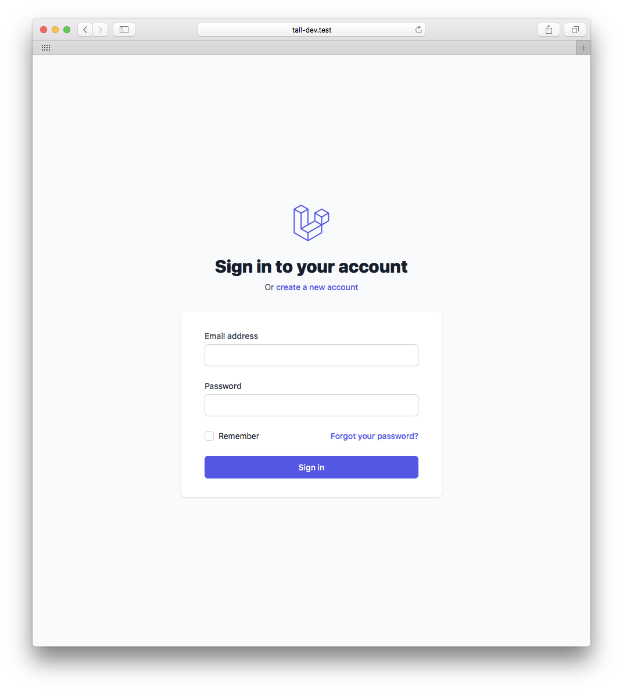

# Laravel TALL Preset

[](https://github.com/laravel-frontend-presets/tall/actions)
[](https://poser.pugx.org/laravel-frontend-presets/tall/d/total.svg)

A front-end preset for Laravel to scaffold an application using the TALL stack, to help you get developing your application quickly.

If you're not familiar with the name, it's an acronym that describes the main technologies involved in the stack:

- [TailwindCSS](https://tailwindcss.com/)
- [Alpine.js](https://github.com/alpinejs/alpine)
- [Laravel](https://laravel.com/)
- [Livewire](https://laravel-livewire.com/)

Here are some notable features:

- Views extend a default layout
- Front-end assets like TailwindCSS and AlpineJS are set up with Laravel Mix
- [Tailwind UI](https://tailwindui.com/) and Tailwind's [Custom Forms](https://github.com/tailwindcss/custom-forms) extensions are available out-of-the-box

## Installation (without auth)

To install the preset in a fresh Laravel application, make sure to run the following commands:

```bash
composer require laravel-frontend/presets/tall
php artisan preset tall
npm install
npm run dev
```

## Installation (with auth)

If you want authentication in your application, make sure to use the `--auth` flag on the preset command to get all the relevant routes, controllers, components and views:

```bash
composer require laravel-frontend-presets/tall
php artisan preset tall --auth
npm install
npm run dev
```

There are some notable things about the authentication scaffolding, too:

- Most of the auth scaffolding comes as Livewire components
- The parts that can't be components are set up as single-action controllers
- The auth components come with full tests

All routes, components, controllers and tests are published to your application. The idea behind this is that you can then take full control over every aspect of the scaffolding in your own app and not need to dig around in the vendor folder to figure out how things are working.



## Removing the package

If you don't want to keep this package installed once you've installed the preset, you can safely remove it with a couple of extra steps. Unlike the default Laravel presets, this one publishes all the auth logic to your own `app/` directory, so there is no logic being depended upon within the package itself.

Firstly, make sure add Livewire as a dependency into your own project:

```bash
composer require livewire/livewire
```

If you are using pagination, set the default pagination views to the ones provided in the `boot` method of a service provider:

```php
use Illuminate\Pagination\Paginator;
use Illuminate\Support\ServiceProvider;

class AppServiceProvider extends ServiceProvider
{
    public function boot()
    {
        Paginator::defaultView('pagination::default');

        Paginator::defaultSimpleView('pagination::simple-default');
    }
}
```

That's it, you should now be able to remove the package:

```bash
composer remove laravel-frontend-presets/tall
```

## Credits

- [Dan Harrin](https://github.com/danharrin)
- [Liam Hammett](https://github.com/imliam)
- [Ryan Chandler](https://github.com/ryangjchandler)
- [TailwindUI](https://tailwindui.com/) for the default authentication and pagination views
- [All Contributors](../../contributors)
